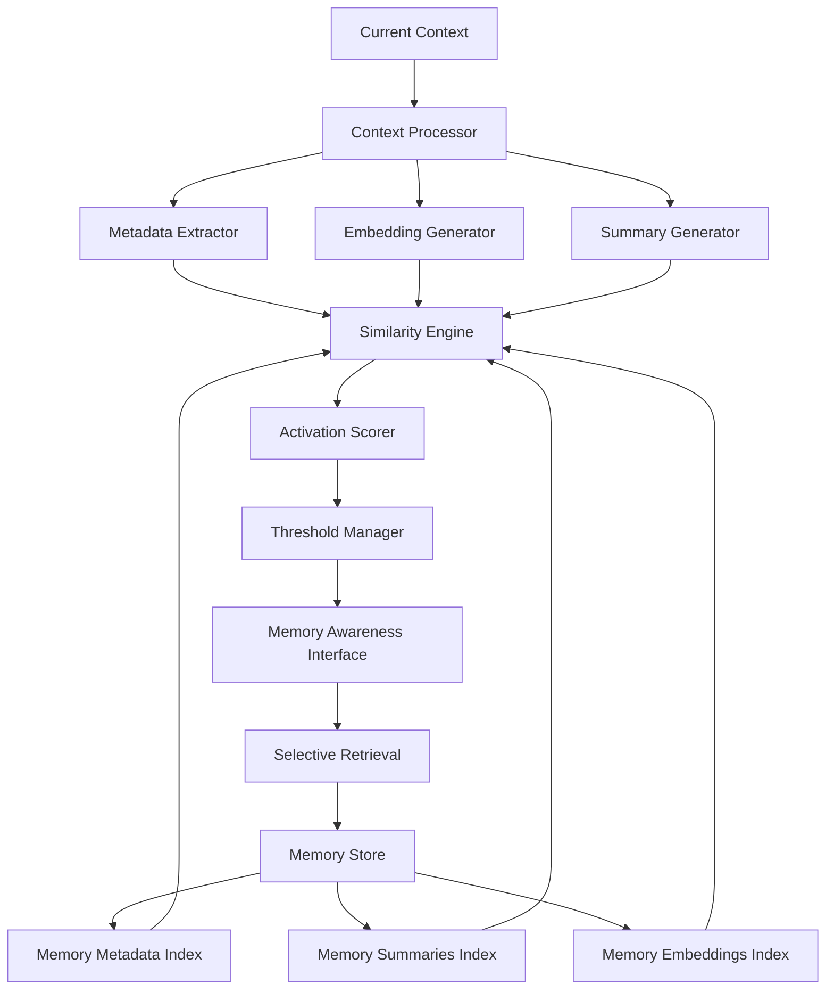

# Design Document: Shadow Memory System

## Overview

The Shadow Memory System implements a multi-layered memory management approach that maintains awareness of historical memories through lightweight representations. The system uses AI-generated summaries, embedding vectors, and metadata to compute activation scores, enabling efficient memory retrieval without loading complete memory content into active context.

The core innovation is the "shadow" concept - the AI knows memories exist and their relevance without accessing their full content, similar to how humans might remember having a conversation about a topic without recalling every detail until prompted.

## Architecture

The system follows a layered architecture with clear separation between memory storage, representation generation, similarity computation, and retrieval management.



## Components and Interfaces

### Context Processor
**Purpose**: Analyzes current context and generates multiple representations for similarity matching.

**Key Methods**:
- `extractMetadata(context: Context): Metadata`
- `generateEmbedding(context: Context): EmbeddingVector`
- `createSummary(context: Context): Summary`

**Responsibilities**:
- Parse and normalize current context
- Extract semantic and structural metadata
- Generate embedding vectors using pre-trained models
- Create contextual summaries highlighting key information

### Memory Store
**Purpose**: Persistent storage for complete memories and their representations.

**Key Methods**:
- `storeMemory(memory: Memory): MemoryId`
- `retrieveMemory(id: MemoryId): Memory`
- `updateMemoryRepresentations(id: MemoryId, representations: MemoryRepresentations): void`

**Data Structure**:
```typescript
interface Memory {
  id: MemoryId;
  content: string;
  timestamp: Date;
  metadata: Metadata;
  summary: Summary;
  embedding: EmbeddingVector;
  accessCount: number;
  lastAccessed: Date;
}
```

### Similarity Engine
**Purpose**: Computes multi-dimensional similarity scores between current context and memory representations.

**Key Methods**:
- `computeEmbeddingSimilarity(contextEmbedding: EmbeddingVector, memoryEmbedding: EmbeddingVector): number`
- `computeMetadataSimilarity(contextMetadata: Metadata, memoryMetadata: Metadata): number`
- `computeSummarySimilarity(contextSummary: Summary, memorySummary: Summary): number`

**Similarity Metrics**:
- **Embedding Similarity**: Cosine similarity between embedding vectors
- **Metadata Similarity**: Weighted Jaccard similarity for categorical attributes, normalized distance for numerical attributes
- **Summary Similarity**: Semantic similarity using sentence embeddings

### Activation Scorer
**Purpose**: Combines multiple similarity dimensions into unified activation scores.

**Key Methods**:
- `computeActivationScore(similarities: SimilarityScores, weights: ScoringWeights): number`
- `rankMemoriesByActivation(scores: Map<MemoryId, number>): MemoryId[]`

**Scoring Formula**:
```
activation_score = (w1 * embedding_similarity) + 
                  (w2 * metadata_similarity) + 
                  (w3 * summary_similarity) + 
                  (w4 * temporal_decay_factor)
```

### Threshold Manager
**Purpose**: Manages activation score thresholds and adaptive threshold tuning.

**Key Methods**:
- `getThreshold(contextType: ContextType): number`
- `updateThreshold(contextType: ContextType, newThreshold: number): void`
- `adaptThresholds(usageAnalytics: UsageAnalytics): void`

**Adaptive Logic**:
- Track retrieval success rates for different threshold levels
- Adjust thresholds based on false positive/negative rates
- Consider memory storage constraints and processing capacity

### Memory Awareness Interface
**Purpose**: Provides the AI with awareness of relevant memories without auto-loading content.

**Key Methods**:
- `getMemoryAwareness(context: Context): MemoryAwareness[]`
- `explainRelevance(memoryId: MemoryId, context: Context): RelevanceExplanation`
- `requestMemoryRetrieval(memoryId: MemoryId): Memory`

### Benchmark Manager
**Purpose**: Measures and compares system performance against standard memory benchmarks.

**Key Methods**:
- `runBenchmarkSuite(benchmarkType: BenchmarkType): BenchmarkResults`
- `compareAgainstBaseline(results: BenchmarkResults, baseline: BenchmarkBaseline): ComparisonReport`
- `trackPerformanceMetrics(operation: OperationType, metrics: PerformanceMetrics): void`

**Awareness Structure**:
```typescript
interface MemoryAwareness {
  memoryId: MemoryId;
  activationScore: number;
  relevanceType: 'semantic' | 'contextual' | 'temporal' | 'mixed';
  summary: string;
  confidence: number;
}
```

## Data Models

### Context Representation
```typescript
interface Context {
  content: string;
  metadata: {
    topics: string[];
    entities: Entity[];
    intent: string;
    temporalMarkers: Date[];
    structuralElements: StructuralElement[];
  };
  embedding: EmbeddingVector;
  summary: string;
}
```

### Memory Representations
```typescript
interface MemoryRepresentations {
  metadata: {
    topics: string[];
    entities: Entity[];
    concepts: string[];
    relationships: Relationship[];
    importance: number;
  };
  summary: {
    content: string;
    keyInsights: string[];
    contextualRelevance: string[];
  };
  embedding: {
    vector: number[];
    model: string;
    dimensions: number;
  };
}
```

### Similarity Scores
```typescript
interface SimilarityScores {
  embeddingSimilarity: number;
  metadataSimilarity: number;
  summarySimilarity: number;
  temporalRelevance: number;
}
```

### Benchmark Data Models
```typescript
interface BenchmarkResults {
  benchmarkType: 'retrieval_accuracy' | 'similarity_computation' | 'memory_efficiency' | 'temporal_performance';
  metrics: {
    precision: number;
    recall: number;
    f1Score: number;
    latency: number;
    memoryUsage: number;
    throughput: number;
  };
  testCases: number;
  timestamp: Date;
}

interface BenchmarkBaseline {
  name: string;
  version: string;
  results: BenchmarkResults;
  description: string;
}

interface ComparisonReport {
  improvements: string[];
  regressions: string[];
  overallScore: number;
  detailedMetrics: Map<string, number>;
}
```

## Correctness Properties

*A property is a characteristic or behavior that should hold true across all valid executions of a system-essentially, a formal statement about what the system should do. Properties serve as the bridge between human-readable specifications and machine-verifiable correctness guarantees.*

### Converting EARS to Properties

Based on the prework analysis, I'll convert the testable acceptance criteria into universally quantified properties, consolidating related criteria to avoid redundancy.

**Property 1: Context metadata extraction and normalization**
*For any* input context, the system should extract metadata containing topics, entities, intent, and temporal markers, normalize it to a consistent format, and preserve any hierarchical relationships present in the original structure.
**Validates: Requirements 1.1, 1.2, 1.3**

**Property 2: Semantic fingerprint generation**
*For any* context input, the system should generate fingerprints that capture semantic meaning, such that semantically similar contexts produce similar fingerprints even when using different keywords.
**Validates: Requirements 1.4**

**Property 3: Complete memory representation generation**
*For any* stored memory, the system should generate all three representations (AI summary, embedding vector, and metadata) where the summary preserves critical information while reducing size, and the embedding captures semantic meaning.
**Validates: Requirements 2.1, 2.2, 2.3, 2.5**

**Property 4: Memory representation consistency**
*For any* memory content update, regenerating the representations (summary, embedding, metadata) should produce updated representations that accurately reflect the new content.
**Validates: Requirements 2.4**

**Property 5: Complete metadata storage**
*For any* new memory, the system should store metadata alongside full content, including temporal, contextual, and semantic attributes, and maintain indexed access for efficient searching.
**Validates: Requirements 3.1, 3.2, 3.3**

**Property 6: Incremental metadata updates**
*For any* memory with existing metadata, incremental updates should modify only the changed portions without requiring full reprocessing of unchanged elements.
**Validates: Requirements 3.4**

**Property 7: Multi-dimensional activation scoring**
*For any* current context and memory representation pair, the system should compute activation scores using embedding similarity, metadata matching, and summary similarity, with appropriate weighting based on context type.
**Validates: Requirements 4.1, 4.2, 4.3, 4.4, 4.5**

**Property 8: Memory ranking by activation**
*For any* set of memories with computed activation scores, the system should rank them in descending order of combined relevance strength.
**Validates: Requirements 4.6**

**Property 9: Threshold-based awareness without auto-loading**
*For any* memory with activation score exceeding the configured threshold, the system should indicate memory availability without automatically loading the complete content.
**Validates: Requirements 5.1**

**Property 10: Selective memory retrieval**
*For any* memory retrieval request, the system should load complete memory content and provide summaries with relevance explanations before full retrieval.
**Validates: Requirements 5.2, 5.3**

**Property 11: Multi-memory selective retrieval**
*For any* set of memories with high activation scores, the system should allow selection based on specific criteria rather than retrieving all high-scoring memories.
**Validates: Requirements 5.4**

**Property 12: Configurable threshold management**
*For any* memory type, the system should support configurable activation score thresholds and maintain consistent behavior across similar contexts after threshold adjustments.
**Validates: Requirements 6.1, 6.4**

**Property 13: Adaptive threshold adjustment**
*For any* processing pattern change, the system should adapt thresholds based on retrieval success rates and provide tuning recommendations based on usage analytics.
**Validates: Requirements 6.2, 6.3**

**Property 14: Temporal decay application**
*For any* memory as it ages, the system should apply decay functions that reduce activation scores over time according to configurable decay parameters.
**Validates: Requirements 7.1**

**Property 15: Memory lifecycle management**
*For any* memory with consistently low activation scores, the system should support archival, and when memory patterns change, should update metadata to reflect new relevance relationships.
**Validates: Requirements 7.2, 7.3**

**Property 16: Usage-based cleanup recommendations**
*For any* memory store state, the system should provide cleanup recommendations based on usage patterns and storage constraints.
**Validates: Requirements 7.4**

**Property 17: Benchmark performance measurement**
*For any* benchmark suite execution, the system should measure retrieval accuracy, similarity computation performance, memory efficiency, and temporal performance against established baselines.
**Validates: Benchmarking requirements**

**Property 18: Performance comparison accuracy**
*For any* benchmark results comparison, the system should accurately identify improvements and regressions relative to baseline performance metrics.
**Validates: Benchmarking requirements**

## Error Handling

The system implements comprehensive error handling across all components:

### Context Processing Errors
- **Invalid Context Format**: Return structured error with format requirements
- **Metadata Extraction Failure**: Use fallback extraction with reduced feature set
- **Embedding Generation Failure**: Retry with alternative model or use cached embeddings

### Memory Storage Errors
- **Storage Capacity Exceeded**: Trigger automatic cleanup recommendations
- **Index Corruption**: Rebuild indexes from stored memory representations
- **Representation Generation Failure**: Store memory with partial representations and retry generation

### Similarity Computation Errors
- **Embedding Dimension Mismatch**: Use dimensionality reduction or padding
- **Missing Metadata Fields**: Use partial similarity with available fields
- **Numerical Overflow**: Apply normalization and bounds checking

### Retrieval Errors
- **Memory Not Found**: Return structured error with suggested alternatives
- **Threshold Configuration Error**: Use system defaults with warning
- **Concurrent Access Conflicts**: Implement optimistic locking with retry logic

### Benchmark Errors
- **Benchmark Data Unavailable**: Use synthetic test data with appropriate warnings
- **Baseline Comparison Failure**: Report metrics without comparison context
- **Performance Regression Detection**: Alert when metrics fall below acceptable thresholds

## Testing Strategy

The Shadow Memory System requires comprehensive testing using both unit tests and property-based tests to ensure correctness across the complex similarity computation and memory management workflows.

### Property-Based Testing Approach

**Testing Framework**: Use Hypothesis (Python) or fast-check (TypeScript) for property-based testing with minimum 100 iterations per property test.

**Test Configuration**: Each property test must reference its design document property using the tag format:
- **Feature: shadow-memory, Property 1: Context metadata extraction and normalization**
- **Feature: shadow-memory, Property 7: Multi-dimensional activation scoring**

**Key Testing Strategies**:

1. **Memory Representation Round-Trip Properties**: Test that storing and retrieving memory representations preserves essential information
2. **Similarity Computation Properties**: Verify that similarity scores are symmetric, bounded, and consistent
3. **Threshold Behavior Properties**: Ensure threshold-based decisions are consistent and predictable
4. **Temporal Decay Properties**: Verify that decay functions behave monotonically and respect configured parameters

### Unit Testing Focus Areas

**Specific Examples and Edge Cases**:
- Empty context handling
- Maximum memory storage limits
- Boundary threshold values
- Concurrent access scenarios

**Integration Testing**:
- End-to-end memory storage and retrieval workflows
- Multi-component similarity computation pipelines
- Threshold adaptation feedback loops

**Error Condition Testing**:
- Invalid input formats
- Storage system failures
- Network connectivity issues for embedding services
- Memory corruption scenarios

### Test Data Generation

**Context Generators**: Create diverse contexts with varying:
- Content types (text, structured data, mixed formats)
- Metadata complexity (simple tags to complex hierarchies)
- Semantic similarity levels

**Memory Generators**: Generate memories with:
- Different content sizes and structures
- Varying temporal characteristics
- Diverse metadata attribute combinations

**Similarity Test Cases**: Generate test cases that verify:
- Embedding similarity calculations
- Metadata matching accuracy
- Summary-based relevance scoring
- Combined activation score computation

### Benchmark Testing Strategy

**Standard Memory Benchmarks**: Compare against established benchmarks including:
- **Information Retrieval Benchmarks**: TREC, MS MARCO for retrieval accuracy
- **Semantic Similarity Benchmarks**: STS (Semantic Textual Similarity) datasets
- **Memory Efficiency Benchmarks**: Custom benchmarks measuring memory usage vs. retrieval quality
- **Temporal Performance Benchmarks**: Time-series memory access patterns

**Benchmark Metrics**:
- **Retrieval Accuracy**: Precision, recall, F1-score for relevant memory identification
- **Similarity Quality**: Correlation with human similarity judgments
- **Memory Efficiency**: Memory usage per stored item, compression ratios
- **Temporal Performance**: Response time for similarity computation, scaling characteristics

**Continuous Benchmarking**: Automated benchmark runs on:
- System updates and configuration changes
- Regular intervals to detect performance drift
- Different data scales to verify scalability assumptions

**Benchmark Integration**: The system will integrate with standard memory and information retrieval benchmarks to ensure competitive performance and provide objective performance comparisons against existing memory management approaches.